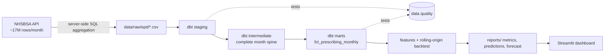

# Forecasting NHS prescribing volume
**[Live dashboard](https://nhs-prescribing-forecast.streamlit.app)**
End-to-end forecasting pipeline on real public health data: monthly prescription items
in England per NHS region and BNF chapter (105 series), forecast 1 to 3 months ahead.

**Stack:** Python · NHSBSA Open Data API · DuckDB · dbt · scikit-learn · Streamlit · GitHub Actions



## Results

Rolling-origin backtest over 12 origins (May 2025 to April 2026), horizons 1 to 3 months,
105 series, data January 2021 to July 2026. Full tables in [`reports/evaluation.md`](reports/evaluation.md).

| model | MAE (items) | WAPE | MASE |
|---|---:|---:|---:|
| **Gradient boosting** | **30,125** | **3.09%** | **0.819** |
| Seasonal naive | 36,310 | 3.73% | 0.876 |
| Last value | 54,885 | 5.64% | 1.471 |

The model cuts error by **17% relative to the best baseline** (seasonal naive).
The gain is modest, which is expected: prescribing volume is strongly seasonal,
so "same month last year" is already a hard benchmark.

**Where the model wins and where it doesn't**

- It beats seasonal naive in **10 of 15 BNF chapters**, including all high-volume ones
  (Cardiovascular, Central Nervous System, Endocrine, Gastro-Intestinal).
- It loses in **Eye, Ear/Nose/Oropharynx, Skin and Anaesthesia** by 0.2 to 0.6 percentage points.
  These are smaller chapters where the yearly pattern repeats cleanly and the model adds noise.
- It fails clearly on **Immunological Products and Vaccines** (23.9% vs 9.2% WAPE).
  Volume there is driven by vaccination campaigns whose timing and scale change from
  year to year, which lagged volume features cannot anticipate. "Last value" scores 127.6%,
  which shows how spiky the series is.
- Results per horizon are scored on different target months, so the small differences between
  h1, h2 and h3 are not a like-for-like comparison of horizon difficulty.

## Quickstart

```bash
make install
make data      # pull real EPD aggregates (START=202101 by default)
make dbt       # build models + run all data quality tests
make train     # backtest, evaluation report, final forecast
make app       # dashboard
```

Offline or in CI: `make ci` runs the same pipeline on synthetic data with the identical schema.

On Windows without `make`, run the commands from the Makefile directly.

## Design decisions

**Aggregate at the source.** Each EPD month has ~17M rows. `fetch_epd.py` pushes a
`GROUP BY` to the portal's SQL endpoint and stores ~165 rows per month. Loads are incremental:
existing months are skipped.

**Defensive extraction.** The March 2025 release stores `TOTAL_QUANTITY` as text instead of a
number, which broke the aggregation query. Every numeric column is now cast explicitly, failed casts
are counted on the server, and a month with any failed cast is rejected instead of being summed wrong.

**dbt layers.** Staging normalises types and flags prescriptions that cannot be attributed to a region.
The intermediate model builds a complete month × series grid, so gaps stay visible as `NULL`
instead of being silently zero-filled. Marts are what Python reads.

**Data quality checks** (`dbt build` stops the pipeline on errors):
- a whole month missing from the load (error)
- non-negative items, valid chapter codes, unique series-month keys, referential integrity (error)
- unexpected region codes, gaps inside a series (warn)
- national volume jumping more than 25% month-on-month (warn)
- more than 1% of items unattributable to a region (warn)
- implausible cost per item (warn)
- source freshness: latest month older than 100 days (warn)

**Evaluation.** At each origin the model trains only on targets up to that month (asserted in code
and unit-tested), then predicts 1 to 3 months ahead. Both baselines are scored on exactly the same rows.
Metrics: MAE, WAPE, and MASE scaled by in-sample seasonal-naive error, reported overall, per horizon
and per BNF chapter, including the chapters where the model loses.

**Model.** One `HistGradientBoostingRegressor` across all series and horizons (direct strategy,
horizon as a feature). It predicts the log ratio of the target to the recent 3-month level,
which puts series of very different size on one scale. Loss is absolute error, matching the reported metrics.

## Limitations and next steps

- **Vaccines need a different approach.** Campaign-driven demand should be modelled with campaign
  calendars, or fall back to seasonal naive for that chapter.
- **Working days are missing.** Prescription volume depends on bank holidays and weekdays per month;
  adding them as a feature is the most likely improvement.
- BNF codes and region boundaries change over time; the chapter level is the most stable grain.
- 2021 data still carries COVID-era effects; the backtest window starts in 2025.
- Item counts are not patients or doses.

## Data

NHS Business Services Authority, English Prescribing Dataset (EPD) with SNOMED Code,
Open Government Licence v3.0. NHSBSA Copyright 2025.