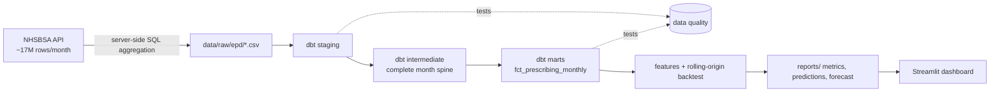

# Forecasting NHS prescribing volume

End-to-end forecasting pipeline on real public health data: monthly prescription items
in England per NHS region and BNF chapter (105 series), forecast 1 to 3 months ahead.

**Stack:** Python · NHSBSA Open Data API · DuckDB · dbt · scikit-learn · Streamlit · GitHub Actions



## Results

See [`reports/evaluation.md`](reports/evaluation.md) (regenerated every run).

| model | WAPE | MASE |
|---|---:|---:|
| Gradient boosting | _fill in_ | _fill in_ |
| Seasonal naive | _fill in_ | _fill in_ |
| Last value | _fill in_ | _fill in_ |

## Quickstart

```bash
make install
make data      # pull real EPD aggregates (START=202101 by default)
make dbt       # build models + run all data quality tests
make train     # backtest, evaluation report, final forecast
make app       # dashboard
```

Offline or in CI: `make ci` runs the same pipeline on synthetic data with the identical schema.

## Design decisions

**Aggregate at the source.** Each EPD month has ~17M rows. `fetch_epd.py` pushes a
`GROUP BY` to the portal's SQL endpoint and stores ~200 rows per month. Loads are incremental:
existing months are skipped.

**dbt layers.** Staging normalises types and flags prescriptions that cannot be attributed to a region.
The intermediate model builds a complete month × series grid, so gaps stay visible as `NULL`
instead of being silently zero-filled. Marts are what Python reads.

**Data quality checks** (`dbt build` stops the pipeline on errors):
- a whole month missing from the load (error)
- non-negative items, valid chapter codes, unique series-month keys, referential integrity (error)
- unexpected region codes, gaps inside a series (warn)
- national volume jumping more than 25% month-on-month (warn)
- more than 1% of items unattributable to a region (warn)
- implausible cost per item (warn)
- source freshness: latest month older than 100 days (warn)

**Evaluation.** Rolling-origin backtest over 12 origins. At each origin the model trains only on
targets up to that month (asserted in code and unit-tested), then predicts 1 to 3 months ahead.
Two baselines, seasonal naive and last value, are scored on exactly the same rows. Metrics:
MAE, WAPE, and MASE scaled by in-sample seasonal-naive error, reported overall, per horizon
and per BNF chapter, including chapters where the model loses.

**Model.** One `HistGradientBoostingRegressor` across all series and horizons (direct strategy,
horizon as a feature). It predicts the log ratio of the target to the recent 3-month level,
which puts series of very different size on one scale. Loss is absolute error, matching the reported metrics.

## Limitations

- BNF codes and region boundaries change over time; the chapter level is the most stable grain.
- COVID-era months (2021) distort seasonality; the backtest window starts after them.
- Item counts are not patients or doses.

## Data

NHS Business Services Authority, English Prescribing Dataset (EPD) with SNOMED Code,
Open Government Licence v3.0. NHSBSA Copyright 2025.
